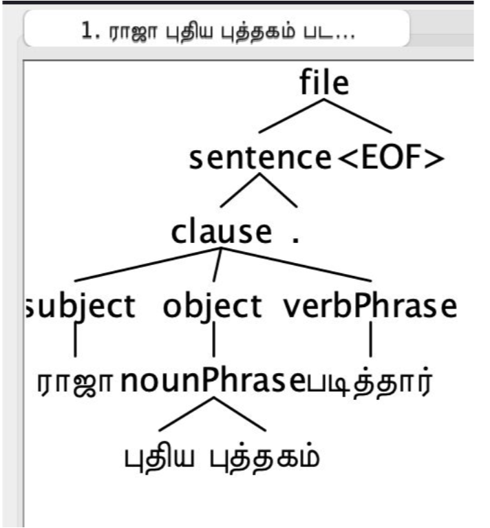
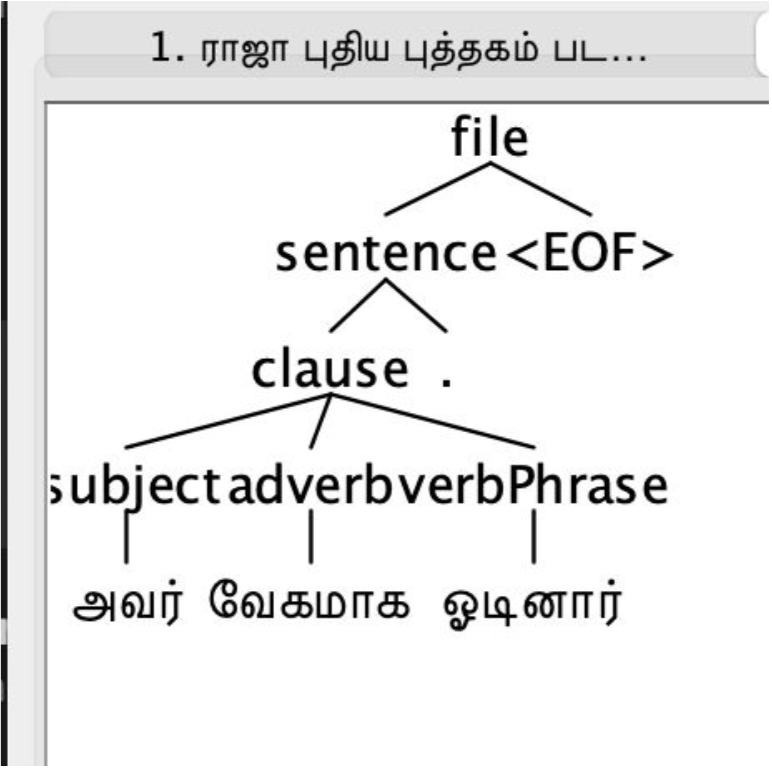
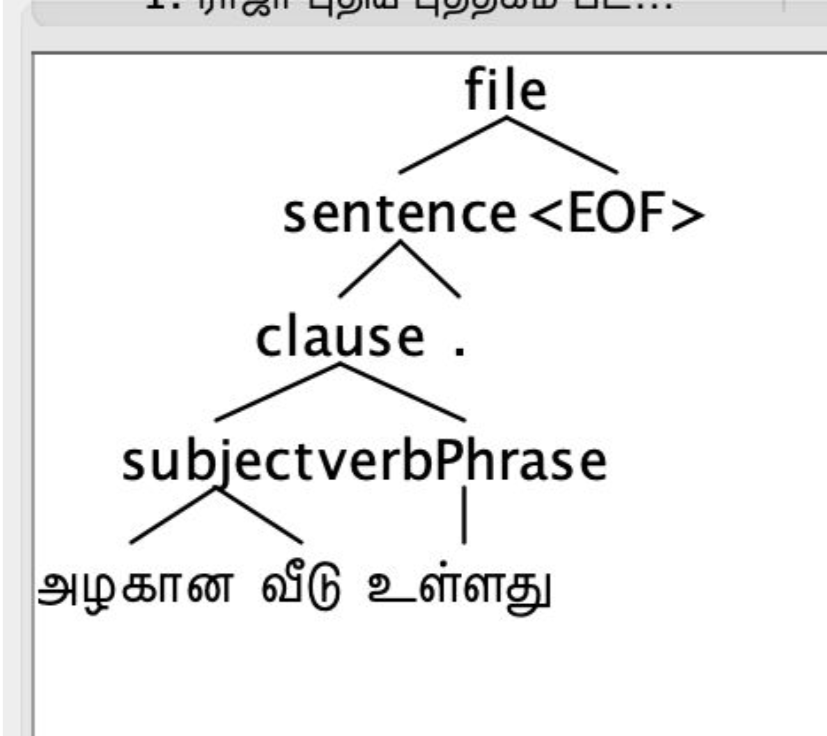
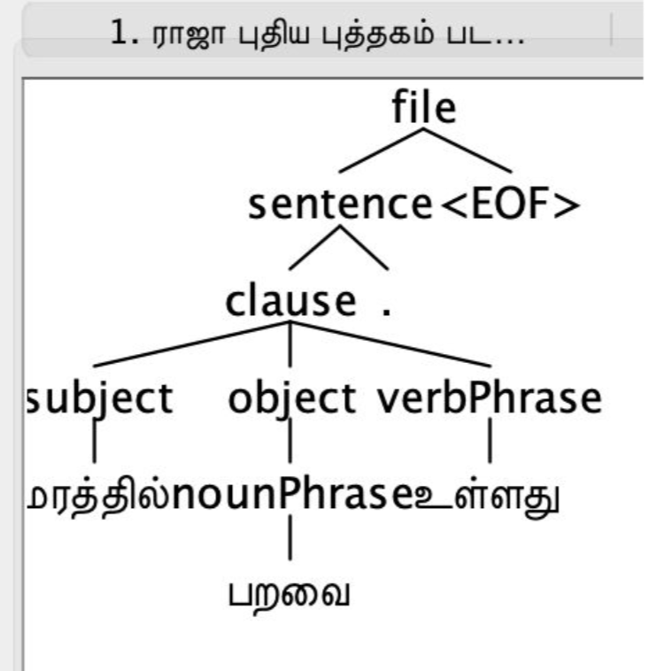
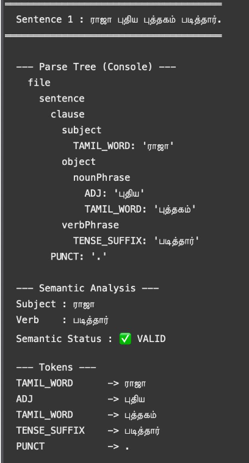
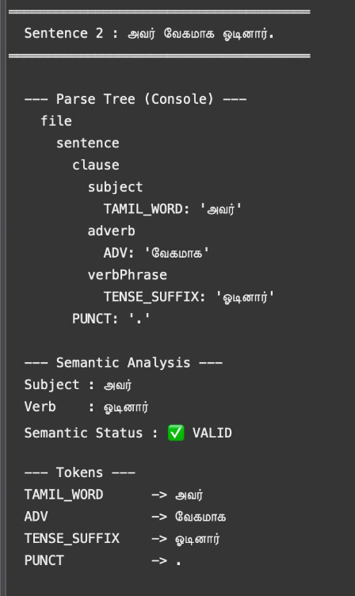
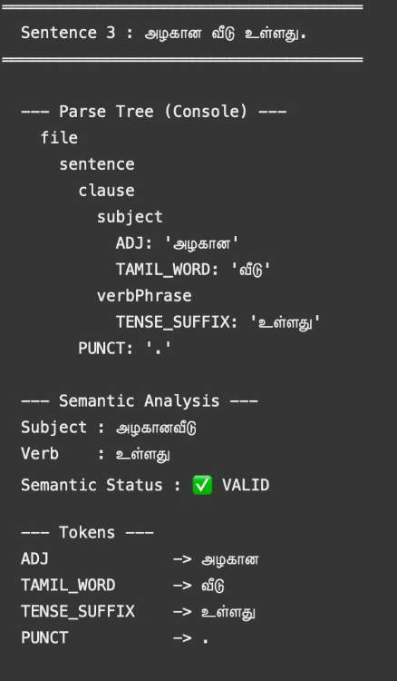
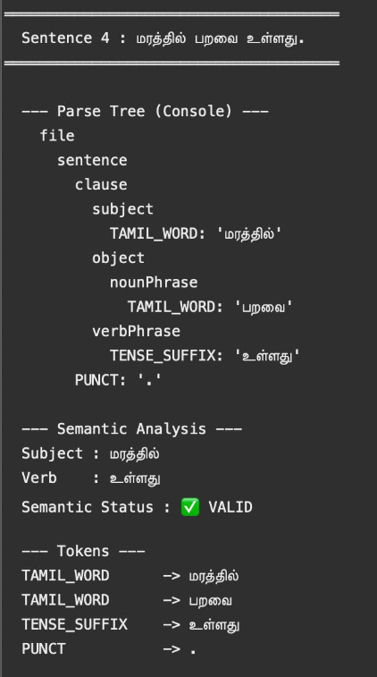

# 🧠 Tamil Semantic Analyzer using ANTLR4

### 🚀 NLP | Compiler Design | Syntax + Semantic Analysis


---

## 📌 Overview

This project implements a **Tamil Language Semantic Analyzer** using **ANTLR4**, capable of:

* Parsing Tamil sentences 🌳
* Generating **Parse Trees (GUI + Console)**
* Performing **Semantic Validation** 🧠
* Detecting **grammatical & agreement errors**

---

## 🎯 Key Highlights

✨ Built custom **Tamil Grammar (ANTLR4)**
✨ Supports **real Tamil sentence structures**
✨ Detects **semantic errors (subject–verb mismatch)**
✨ Handles:

* Simple sentences
* Questions ❓
* Compound sentences 🔗
* Numeric & Tamil numbers

---

## 🏗️ Architecture

```text
Input Sentence
      ↓
Lexer (Tokenization)
      ↓
Parser (Grammar Rules)
      ↓
Parse Tree Generation
      ↓
Semantic Analyzer
      ↓
Output (VALID / INVALID + Explanation)
```

---

## 📂 Project Structure

```bash
📁 Tamil-Semantic-Analyzer
 ├── Tamil.g4              # Grammar file (Parser + Lexer)
 ├── Main.java             # Execution logic
 ├── input.txt             # Input dataset
 ├── outputs/              # Results
 └── screenshots/          # Parse tree images
```

---

## 🧪 Input Dataset

### ✅ Valid Sentences

```tamil
ராஜா புதிய புத்தகம் படித்தார்.
அவர் வேகமாக ஓடினார்.
அழகான வீடு உள்ளது.
மரத்தில் பறவை உள்ளது.
```

### ❌ Invalid Sentences

```tamil
நான் வந்தார்கள்.
அவன் வந்தார்கள்.
அவர்கள் வந்தான்.
```

### ❓ Questions

```tamil
எப்படி வந்தான்?
எப்போது தொடங்கும்?
ஏன் நாம் வந்தில்லை?
```

### 🔗 Compound Sentence

```tamil
அழகான சிறுவன் பள்ளிக்கு சென்றார் ஆனால் அவர் மெதுவாக நடந்தார்.
```

---

## 📊 Sample Output

### 🌳 Parse Tree

```text
file
 └── sentence
      └── clause
           ├── subject → ராஜா
           ├── object  → புதிய புத்தகம்
           └── verb    → படித்தார்
```

---

### 🧠 Semantic Analysis

```text
Subject : ராஜா
Verb    : படித்தார்
Semantic Status : ✅ VALID
```

---

### ❌ Error Detection

```text
Sentence : நான் வந்தார்கள்

Error :
'நான்' must use verb ending 'ேன்'

Semantic Status : ❌ INVALID
```

---

## 🖼️ Visualization (GUI)


















✔ Zoom In / Zoom Out
✔ Multi-tab sentence view
✔ Interactive tree navigation

---

## 🧠 Semantic Rules Implemented

| Subject Type | Rule                            |
| ------------ | ------------------------------- |
| நான்         | verb must end with **ேன்**      |
| நாங்கள்      | verb must end with **ோம்**      |
| அவர்கள்      | plural verb (**ார்கள் / ினர்**) |
| அவன்         | verb ends with **ஆன்**          |
| அவள்         | verb ends with **ஆள்**          |

📌 Grammar Implementation:
👉 

📌 Execution Logic:
👉 

---

## ▶️ How to Run

### Step 1: Generate ANTLR Files

```bash
antlr4 Tamil.g4
javac *.java
```

### Step 2: Run Program

```bash
java Main input.txt
```

---

## 📈 Results

✔ Successfully parsed **50+ Tamil sentences**
✔ Correctly identified **semantic errors**
✔ Generated **accurate parse trees**
✔ Handled **complex sentence structures**

---

## 🚀 Future Enhancements

* 🔍 POS Tagging
* 🌐 Web-based UI
* 🤖 ML-based Tamil NLP
* 📊 Dependency Parsing

---

## 👨‍💻 Author

**Sushil V**
🎓 3rd Year Engineering Student
💻 Interested in NLP | Systems | Backend

---

## 🌟 Show Your Support

If you like this project:

⭐ Star this repo
🍴 Fork it
📢 Share it

---

## 📬 Connect With Me

* GitHub: *https://github.com/SUSHILV-30*


---


